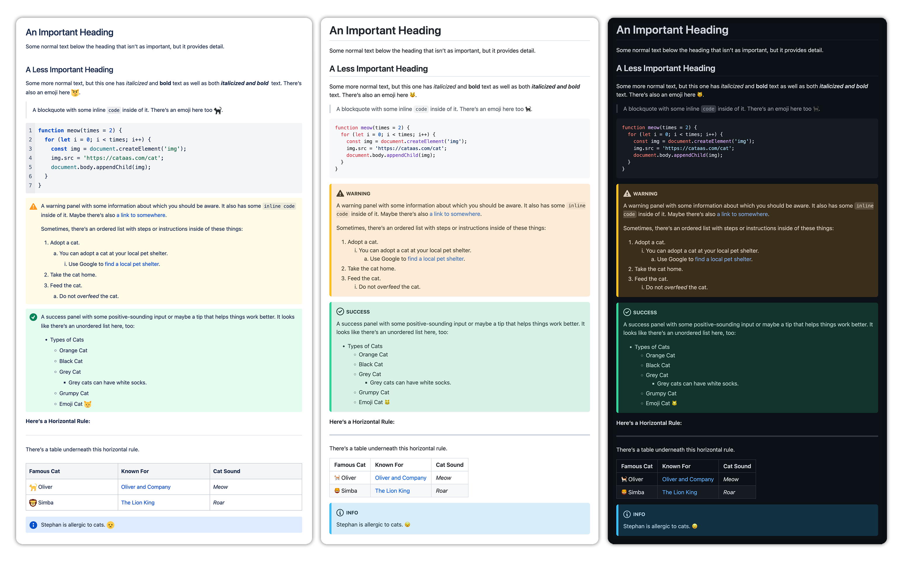

# ADF2MD

ADF2MD offers you conversion of Atlassian's ADF (Atlassian Document Format) syntax into GitHub-flavored markdown — with special considerations for ADF-specific nodes.

### Why?

I don't know. Ask Atlassian.

<p align="center"></p>

## Install

ADF2MD can be included as part of your project, or installed via CDN in the browser.

### NPM

You can install the package via NPM:

```sh
npm install adf2md
```

Then, import the required functions into your project as needed:

```js
import { convert, preview } from 'adf2md';
```

If you're making use of the preview function, don't forget to include the stylesheet, `adf2md.min.css`, somewhere in your document or bundle.

### Browser/CDN

Include the `<script>` and `<link>` tags in your documents' `<head>` from UNPKG, or another CDN:

```html
<script src="//unpkg.com/adf2md@latest/dist/adf2md.min.js">
<link rel="stylesheet" href="//unpkg.com/adf2md@latest/dist/adf2md.min.css">
```

## Usage

ADF2MD includes two basic functions for working with the Atlassian Document format:

### `ADF2MD.convert()`

Use `ADF2MD.convert()` to convert an ADF payload into a markdown string.

| Arg          | Default | Description                             |
| :----------- | :------ | :-------------------------------------- |
| `adfPayload` |         | The ADF payload to convert to markdown. |

```js
(async () => {
  const markdown = await fetch('https://xyz.atlassian.net/issues/ATL-22', {
    method: 'GET',
    headers: { Authorization: 'Bearer ...' },
  })
    .then((res) => res.json())
    .then(({ fields: { description } }) => ADF2MD.convert(description));

  console.log(markdown);
})();
```

### `ADF2MD.preview()`

Use `ADF2MD.preview()` to render an ADF payload as GitHub-flavored markdown.

| Arg          | Default  | Description                                                             |
| :----------- | :------- | :---------------------------------------------------------------------- |
| `adfPayload` |          | The ADF payload to preview.                                             |
| `el`         | `'body'` | The target element or element selector where the preview should render. |

```js
fetch('https://xyz.atlassian.net/issues/ATL-22', {
  method: 'GET',
  headers: { Authorization: 'Bearer ...' },
})
  .then((res) => res.json())
  .then(({ fields: { description } }) =>
    ADF2MD.preview(description, '#markdown-preview'),
  );
```

## Coverage

ADF2MD offers coverage for the following ADF nodes:

| Node          | Status          | Notes                                     |
| :------------ | :-------------- | :---------------------------------------- |
| `blockquote`  | Full Support    |                                           |
| `bulletList`  | Full Support    |                                           |
| `codeBlock`   | Full Support    |                                           |
| `emoji`       | Full Support    |                                           |
| `hardBreak`   | Full Support    |                                           |
| `heading`     | Full Support    |                                           |
| `inlineCard`  | No Support      |                                           |
| `listItem`    | Full Support    |                                           |
| `media`       | No support      |                                           |
| `mediaGroup`  | No support      |                                           |
| `mediaSingle` | No support      |                                           |
| `mention`     | No support      |                                           |
| `orderedList` | Full Support    |                                           |
| `panel`       | Full Support    | Using MDX-style admonition.               |
| `paragraph`   | Full Support    |                                           |
| `rule`        | Full Support    |                                           |
| `table`       | Partial Support | Column alignment is not supported in ADF. |
| `tableCell`   | Partial Support | Column alignment is not supported in ADF. |
| `tableHeader` | Partial Support | Column alignment is not supported in ADF. |
| `tableRow`    | Partial Support | Column alignment is not supported in ADF. |
| `text`        | Full Support    |                                           |
| `code`        | Full Support    |                                           |
| `em`          | Full Support    |                                           |
| `link`        | Full Support    |                                           |
| `strike`      | No Support      |                                           |
| `strong`      | Full Support    |                                           |
| `subsup`      | No Support      |                                           |
| `textColor`   | No Support      |                                           |
| `underline`   | No Support      |                                           |

## License

MIT License | Copyright (c) 2022 Stephan Casas
